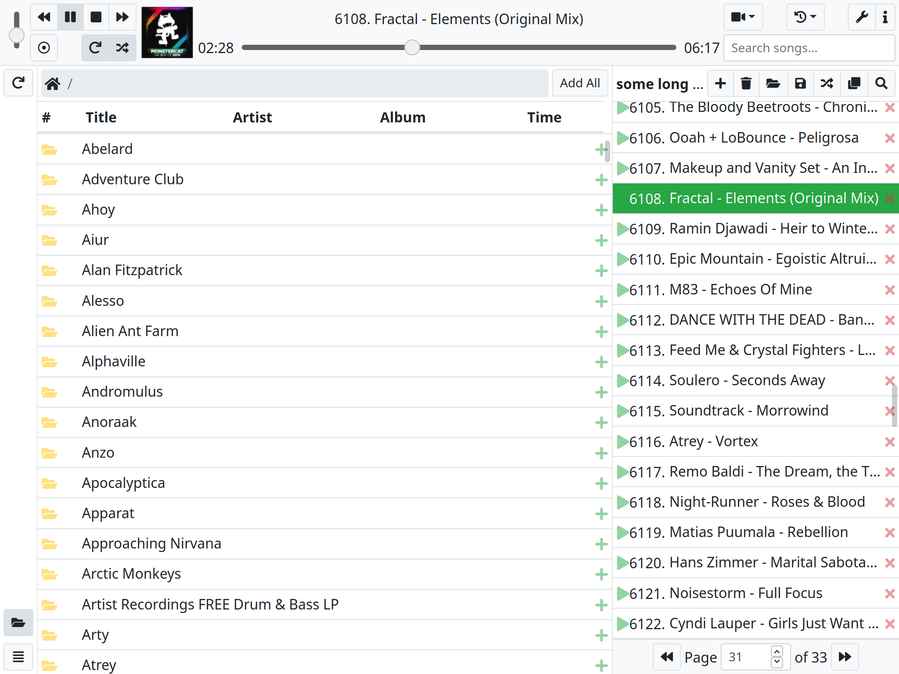
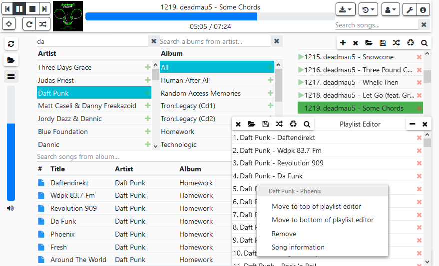

MPCParty
========

This is yet another MPD web client. It was inspired to be used in multi-user environments, such as LAN parties. Previously I've used Client175, however as more users connect (~5) to Client175, it becomes slow, and eventually "freezes", requiring a restart of the server. I still recommend Client175 because of general stability, but if there are a lot of users connecting, MPCParty may be a better choice.

The interface is similar to Client175, while using Nodejs as a backend for better synchronization and performance between the server and the clients (hopefully).

Showing the Default theme, and file browser view

Showing the Materialish theme, library view, and playlist buffer

## Features
* No need to have a separate web server running!
* Play, pause, repeat, random, skip, seek, previous buttons and volume controls
* Playlist browser
    * Create new, save, overwrite, and load mpd playlists
    * Reorder songs by drag / drop
    * Remove songs by pressing "X"
    * Play song my pressing &#9654; or by double clicking
    * Remove duplicate songs from the playlist
    * Scramble the playlist
    * Right click to: play, remove, and move songs to the top, bottom, or after the currently playing song of the playlist
    * Multiselection (ctrl, shift: remove, drag and drop; right click: add to top, bottom, current)
    * Playlist searching
    * Skip to remove songs (when user voting is disabled)
* File browser
    * Double click folders to browse them
    * Add songs to the playlist by pressing "+" or double clicking
    * Add folders to the playlist by pressing "+"
    * Location bar
    * Add all songs based on current page to the playlist
    * Playlist position indication for songs
    * Folder url linking
    * Drag and drop, multiselection, context menus, column sorting
* Library browser
    * Select songs from their respective artist and album, without worring about files and folders
    * Add all songs from an artist or album by pressing "+" or double clicking
    * Playlist position indication for songs
    * Library url linking
    * Drag and drop, multiselection, context menus, column sorting, search filtering
* Playlist buffer
    * Create and edit playlists without interrupting the current playlist
    * Multiselection (ctrl, shift: remove, drag and drop; right click: add to top, bottom)
    * Right click to remove or move songs to the top or bottom of the playlist
    * Scramble and remove duplicates
* Download Player
    * Download videos, such as from youtube, straight to the music library
* Update music database
* Basic mobile support
* Basic theming support
* Library searching
* Library search url linking

### Multi-user features
* Vote to skip songs (This can be easily bypassed. Might create a strict mode in the future)
* Synchronization between all users (such as playlist modification and player updates)
* Playlist buffer: Create and edit playlists without interrupting the current playlist
* User lists (optional)

## Installation
Read [install.md](install.md).

## Configuration
Edit config.cfg

* Web port (default is 8081)
* MPD url (default is localhost)
* MPD port (default is 6600)
* MPD library location, used for special features like downloading (default is '' (disabled))
* Enable vote skipping (default is true)
* Vote skipping percentage (default is 75%, aka 75% of the users need to vote before taking effect)
* Show user lists (default is false)
* Enable the Downloader (default is true)
* Set the relative Downloader location (default is Downloads)
* Set whether or not to keep the downloaded videos after conversion (default is false)

## Custom Theme Development
* Copy public/css/themes/default-thin and rename it to anything.
* Edit the variables as you see fit. You can look at the bootstrap/less folder to see what modules you want to overwrite.
* Edit view/index.jade in the configuration section, add your theme file name as the value and a name. (This might be changed to auto-populate the select list, but for now, you have to add them manually.)

## Issues
* Something, somewhere, crashes, at what seems to be random times. I've seen this happen with other web clients, so I'm not sure what the cause of this is. It could be MPCParty's code, the komponist library, or MPD itself. Restarting the MPCParty server fixes these issues. You *should* get a popup when it stops responding.
* Not all errors from MPD are handled properly. When this happens, MPCParty will stop working. Refresh the page to fix it. If possible, check the console and report what the error was and what you were doing to cause the error.
* If something is not working, and there is no notification, please report the issue as to what you were doing and what you were expecting. Check the console as to what the error was.

## Contribution
* Read todo.md or the issue tracker for suggestions of things to add or fix.
* The project itself is stored in src/. The js, css, and html is automatically compiled when the page is loaded.
* I recommend using [jshint](http://jshint.com/install/) before sending something.

## License
GNU Lesser General Public License v3 (LGPL-3.0)
